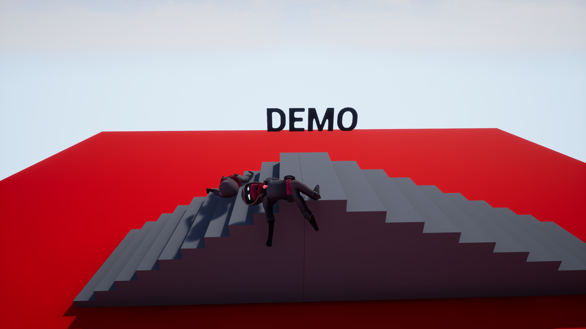
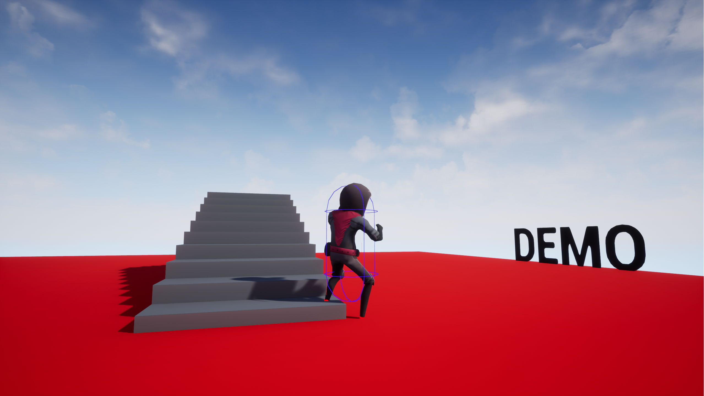
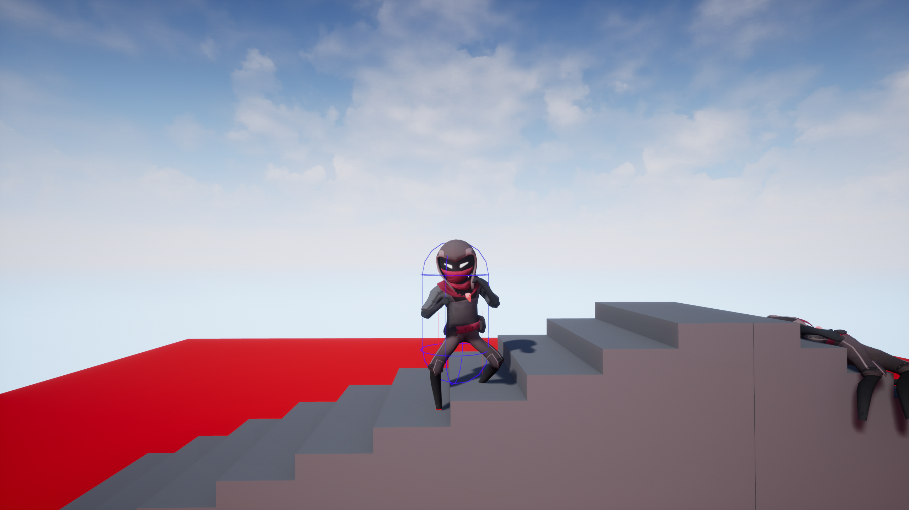

# IKDEMO

A simplistic demo representing alternative animation methods for the foot placements in UE4.19.2.
This is done by having IK foot placement (Not currently fully working just a test demo) and a physics body on the
character so when the IK solver cannot solve the current foot placement the character will fall over and enter "ragdoll mode".

This is by no means a finished project just got the IK working enough to add to a proposal presentation for canalside studios.

----------------------------------------------------------------------------------

----------------------------------------------------------------------------------

----------------------------------------------------------------------------------

----------------------------------------------------------------------------------

