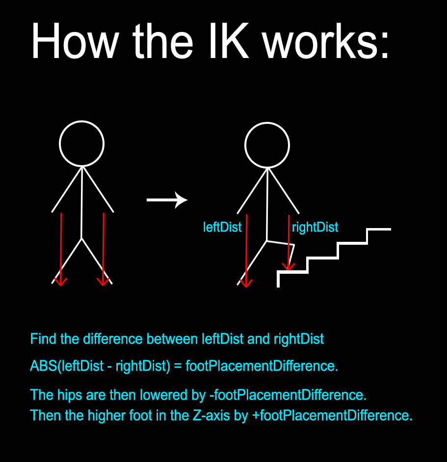

# Inverse Kinematics in Unreal Engine 4

A simplistic demo representing alternative animation methods for the foot placement in UE4.23.
This is done by having IK foot placement (Not currently fully working just a test demo) and a physics body on the
character so when the IK solver cannot solve the current foot placement the character will fall over and enter "ragdoll mode".

Controls:

- WASD movement.
- Space while moving to jump.
- Escape to Quit.
- R to toggle between Ragdoll modes.
- D to enable debug mode.

Known issues:

- After jumping there is a frame where the feet dont know where to position themselves. I have left this as I need to move onto other projects and was only updating this to code...

You can find a build of this small demo here:

https://drive.google.com/file/d/14vGqj0MPAZaYXFmb0PwqZV29ChdOV1rA/view?usp=sharing

NOTE: This is by no means a finished project just got the IK working enough to add to a proposal presentation for canalside studios.

----------------------------------------------------------------------------------

----------------------------------------------------------------------------------

